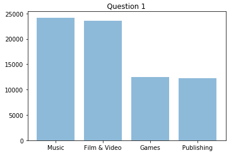
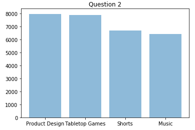

## Naughty Solution: Casper, Ali, Stephan, Nicklas (Jeff)

## Assignment 8 - Black Girl

# Imports
- import pandas as pd
- import numpy as np
- import matplotlib.pyplot as plt
- from collections import Counter
- import webget
- import statistics

# Run

Open terminal and run: python run.py

# All Questions
- 1. What main-category of project has the highest success rate?
- 2. What is the category with the highest number of project proposals?
- 3. What is the median pledged amount (usd_pledged_real) of successfully funded projects?
- 4. What is the number of successfully funded projects with more than 5.000$ pledged (usd_pledged_real) per category?
- 5. For the main-category with the most successfully funded projects (quantity, not rate of success), what is the range of goal-amount (usd_goal_real) a 10k usd range, e.g. range 0-10k$ , 5-15k$, 100k$-110k$, that contains the most successfully funded projects (in quantity, not rate of success)?

https://raw.githubusercontent.com/Caspec/Python/master/Assignments%20-%20Python/assignment8Blackgirl/ks-projects-201801.csv

# What to do:
- Clone github repo: https://github.com/Caspec/Python
- Go to Assignments - Python / assignment8Blackgirl
- Open terminal and run: python run.py

# Question 1:
 

# Question 2:
 

# Question 3:
5107.25

# Question 4:
68710

