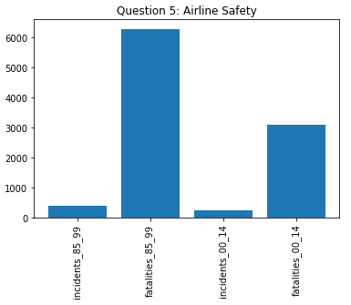

## Naughty Solution: Casper, Ali, Stephan, Nicklas (Jeff)

## Assignment 9 - Gozzath

# Imports
- import pandas as pd
- import numpy as np
- import matplotlib.pyplot as plt
- from collections import Counter
- import webget

# Run

Open terminal and run: python run.py

# All Questions
- 1. How many incidents happened between 1985-1999?
- 2. How many death-incidents happened between 1985-1999?
- 3. How many incidents happened between 2000-2014?
- 4. How many death-incidents happened between 2000-2014?
- 5. Has the amount of incidents increased, comparing the later statistics to the earlier ones?

https://raw.githubusercontent.com/Gozzah/Dataset/master/airline-safety/airline-safety.csv

# What to do:
- Clone github repo: https://github.com/Caspec/Python
- Go to Assignments - Python / assignment9Gozzath
- Open terminal and run: python run.py

# Question 1:
incidents_85_99: 402

# Question 2:
fatalities_85_99: 6295

# Question 3:
incidents_00_14: 231

# Question 4:
fatalities_00_14: 3109

# Question 5:
 